# <center> Predicting Pet Adoption Time Using Decision Tree Ensembles</center>


<br>
The goal of this project is to develop an algorithm to predict the adoptability of pets - specifically, how quickly is a pet adopted? The dataset was part of the [PetFinder.my Adoption Prediction](https://www.kaggle.com/c/petfinder-adoption-prediction).

The final ensemble model used four different classifier algorithms (**Gradient Boosting**, **AdaBoost**, **Random Forest**, and **XGBoost**). The final prediction classes were determined as the average of all four models weighted equally.

<br>

**Table of Contents**
1. [Data Columns](#Data-Columns)
2. [Dataset Overview](#Data-Overview)
3. [Missing Data](#Missing-Data)
4. [Variable Visualizations](#Variable-Visualizations)
5. [Caution Variables](#Caution-Variables)
6. [Data Cleaning](#Data-Cleaning)
7. [Tree Ensemble Modelling](#Tree-Ensemble-Modelling)
8. [Predictions & Submission](#Predictions-&-Submission)

<br>

**Model Accuracy**: (Cohen's Kappa = 0.33809)

    Top submissions on the public leaderboard are around 0.45


**Competition Description**
> Millions of stray animals suffer on the streets or are euthanized in shelters every day around the world. If homes can be found for them, many precious lives can be saved — and more happy families created.


> PetFinder.my has been Malaysia’s leading animal welfare platform since 2008, with a database of more than 150,000 animals. PetFinder collaborates closely with animal lovers, media, corporations, and global organizations to improve animal welfare.

> Animal adoption rates are strongly correlated to the metadata associated with their online profiles, such as descriptive text and photo characteristics. As one example, PetFinder is currently experimenting with a simple AI tool called the Cuteness Meter, which ranks how cute a pet is based on qualities present in their photos.

> In this competition you will be developing algorithms to predict the adoptability of pets - specifically, how quickly is a pet adopted? If successful, they will be adapted into AI tools that will guide shelters and rescuers around the world on improving their pet profiles' appeal, reducing animal suffering and euthanization.

> Top participants may be invited to collaborate on implementing their solutions into AI tools for assessing and improving pet adoption performance, which will benefit global animal welfare.

**Competition Evaluation**
> Submissions are scored based on the quadratic weighted kappa, which measures the agreement between two ratings. This metric typically varies from 0 (random agreement between raters) to 1 (complete agreement between raters).

> In the event that there is less agreement between the raters than expected by chance, the metric may go below 0. The quadratic weighted kappa is calculated between the scores which are expected/known and the predicted scores.


<a id='Data-Columns'></a>

## Data Columns
[Source](https://www.kaggle.com/c/petfinder-adoption-prediction/data)

* **PetID** - Unique hash ID of pet profile
* **AdoptionSpeed** - Categorical speed of adoption. Lower is faster. This is the value to predict. See below section for more info.
* **Type** - Type of animal (1 = Dog, 2 = Cat)
* **Name** - Name of pet (Empty if not named)
* **Age** - Age of pet when listed, in months
* **Breed1** - Primary breed of pet (Refer to BreedLabels dictionary)
* **Breed2** - Secondary breed of pet, if pet is of mixed breed (Refer to BreedLabels dictionary)
* **Gender** - Gender of pet (1 = Male, 2 = Female, 3 = Mixed, if profile represents group of pets)
* **Color1** - Color 1 of pet (Refer to ColorLabels dictionary)
* **Color2** - Color 2 of pet (Refer to ColorLabels dictionary)
* **Color3** - Color 3 of pet (Refer to ColorLabels dictionary)
* **MaturitySize** - Size at maturity (1 = Small, 2 = Medium, 3 = Large, 4 = Extra Large, 0 = Not Specified)
* **FurLength** - Fur length (1 = Short, 2 = Medium, 3 = Long, 0 = Not Specified)
* **Vaccinated** - Pet has been vaccinated (1 = Yes, 2 = No, 3 = Not Sure)
* **Dewormed** - Pet has been dewormed (1 = Yes, 2 = No, 3 = Not Sure)
* **Sterilized** - Pet has been spayed / neutered (1 = Yes, 2 = No, 3 = Not Sure)
* **Health** - Health Condition (1 = Healthy, 2 = Minor Injury, 3 = Serious Injury, 0 = Not Specified)
* **Quantity** - Number of pets represented in profile
* **Fee** - Adoption fee (0 = Free)
* **State** - State location in Malaysia (Refer to StateLabels dictionary)
* **RescuerID** - Unique hash ID of rescuer
* **VideoAmt** - Total uploaded videos for this pet
* **PhotoAmt** - Total uploaded photos for this pet
* **Description** - Profile write-up for this pet. The primary language used is English, with some in Malay or Chinese.


***AdoptionSpeed***
* Contestants are required to predict this value. The value is determined by how quickly, if at all, a pet is adopted. The values are determined in the following way:
* 0 - Pet was adopted on the same day as it was listed.
* 1 - Pet was adopted between 1 and 7 days (1st week) after being listed.
* 2 - Pet was adopted between 8 and 30 days (1st month) after being listed.
* 3 - Pet was adopted between 31 and 90 days (2nd & 3rd month) after being listed.
* 4 - No adoption after 100 days of being listed. (There are no pets in this dataset that waited between 90 and 100 days).

<a id='Data-Overview'></a>

## Data Overview


```python
import os
import pandas as pd
import numpy as np
import matplotlib.pyplot as plt
from matplotlib.ticker import PercentFormatter
import seaborn as sns
import missingno as msno
import statsmodels.api as sm
import scipy as sp

from sklearn.preprocessing import LabelEncoder
from sklearn.metrics import cohen_kappa_score, make_scorer
from sklearn.ensemble import GradientBoostingClassifier, AdaBoostClassifier, ExtraTreesClassifier, RandomForestClassifier
from xgboost.sklearn import XGBClassifier
from sklearn.model_selection import GridSearchCV

%matplotlib inline
sns.set_style("whitegrid")
plt.rcParams["figure.figsize"] = [10,5]


train = pd.read_csv('../input/train/train.csv')
test = pd.read_csv('../input/test/test.csv')
states = pd.read_csv('../input/state_labels.csv')
```


```python
def count_overview(variable, title):
    plt.figure(figsize=(10,4))
    ax = sns.barplot(x=variable, y = variable.index, palette="Spectral")
    ax.set_title(title)
    plt.xlabel('Count')
    plt.tight_layout()
    plt.show()

def stacked_barplot(tab, title):
    tab_percent = tab.apply(lambda r: r/r.sum(), axis=1)
    ax = tab_percent.plot.barh(stacked=True, cmap='Spectral', alpha=0.8)
    ax.set_title(title)
    vals = ax.get_yticks()
    ax.xaxis.set_major_formatter(PercentFormatter(xmax=1, decimals=0))
    ax.legend(loc='upper center', bbox_to_anchor=(0.5, -0.1), shadow=True, ncol=5)
    plt.tight_layout()
    plt.show()
```

### Training Dataset Overview


```python
print("Training Dataset Shape: ", train.shape)
display(train.head(2))
display(train.info())
display(train.describe())

```

    Training Dataset Shape:  (14993, 24)


<div>
<style scoped>
    .dataframe tbody tr th:only-of-type {
        vertical-align: middle;
    }

    .dataframe tbody tr th {
        vertical-align: top;
    }

    .dataframe thead th {
        text-align: right;
    }
</style>
<table border="1" class="dataframe">
  <thead>
    <tr style="text-align: right;">
      <th></th>
      <th>Type</th>
      <th>Name</th>
      <th>Age</th>
      <th>Breed1</th>
      <th>Breed2</th>
      <th>Gender</th>
      <th>Color1</th>
      <th>Color2</th>
      <th>Color3</th>
      <th>MaturitySize</th>
      <th>FurLength</th>
      <th>Vaccinated</th>
      <th>Dewormed</th>
      <th>Sterilized</th>
      <th>Health</th>
      <th>Quantity</th>
      <th>Fee</th>
      <th>State</th>
      <th>RescuerID</th>
      <th>VideoAmt</th>
      <th>Description</th>
      <th>PetID</th>
      <th>PhotoAmt</th>
      <th>AdoptionSpeed</th>
    </tr>
  </thead>
  <tbody>
    <tr>
      <th>0</th>
      <td>2</td>
      <td>Nibble</td>
      <td>3</td>
      <td>299</td>
      <td>0</td>
      <td>1</td>
      <td>1</td>
      <td>7</td>
      <td>0</td>
      <td>1</td>
      <td>1</td>
      <td>2</td>
      <td>2</td>
      <td>2</td>
      <td>1</td>
      <td>1</td>
      <td>100</td>
      <td>41326</td>
      <td>8480853f516546f6cf33aa88cd76c379</td>
      <td>0</td>
      <td>Nibble is a 3+ month old ball of cuteness. He ...</td>
      <td>86e1089a3</td>
      <td>1.0</td>
      <td>2</td>
    </tr>
    <tr>
      <th>1</th>
      <td>2</td>
      <td>No Name Yet</td>
      <td>1</td>
      <td>265</td>
      <td>0</td>
      <td>1</td>
      <td>1</td>
      <td>2</td>
      <td>0</td>
      <td>2</td>
      <td>2</td>
      <td>3</td>
      <td>3</td>
      <td>3</td>
      <td>1</td>
      <td>1</td>
      <td>0</td>
      <td>41401</td>
      <td>3082c7125d8fb66f7dd4bff4192c8b14</td>
      <td>0</td>
      <td>I just found it alone yesterday near my apartm...</td>
      <td>6296e909a</td>
      <td>2.0</td>
      <td>0</td>
    </tr>
  </tbody>
</table>
</div>


    <class 'pandas.core.frame.DataFrame'>
    RangeIndex: 14993 entries, 0 to 14992
    Data columns (total 24 columns):
    Type             14993 non-null int64
    Name             13736 non-null object
    Age              14993 non-null int64
    Breed1           14993 non-null int64
    Breed2           14993 non-null int64
    Gender           14993 non-null int64
    Color1           14993 non-null int64
    Color2           14993 non-null int64
    Color3           14993 non-null int64
    MaturitySize     14993 non-null int64
    FurLength        14993 non-null int64
    Vaccinated       14993 non-null int64
    Dewormed         14993 non-null int64
    Sterilized       14993 non-null int64
    Health           14993 non-null int64
    Quantity         14993 non-null int64
    Fee              14993 non-null int64
    State            14993 non-null int64
    RescuerID        14993 non-null object
    VideoAmt         14993 non-null int64
    Description      14981 non-null object
    PetID            14993 non-null object
    PhotoAmt         14993 non-null float64
    AdoptionSpeed    14993 non-null int64
    dtypes: float64(1), int64(19), object(4)
    memory usage: 2.7+ MB


    None


<div>
<style scoped>
    .dataframe tbody tr th:only-of-type {
        vertical-align: middle;
    }

    .dataframe tbody tr th {
        vertical-align: top;
    }

    .dataframe thead th {
        text-align: right;
    }
</style>
<table border="1" class="dataframe">
  <thead>
    <tr style="text-align: right;">
      <th></th>
      <th>Type</th>
      <th>Age</th>
      <th>Breed1</th>
      <th>Breed2</th>
      <th>Gender</th>
      <th>Color1</th>
      <th>Color2</th>
      <th>Color3</th>
      <th>MaturitySize</th>
      <th>FurLength</th>
      <th>Vaccinated</th>
      <th>Dewormed</th>
      <th>Sterilized</th>
      <th>Health</th>
      <th>Quantity</th>
      <th>Fee</th>
      <th>State</th>
      <th>VideoAmt</th>
      <th>PhotoAmt</th>
      <th>AdoptionSpeed</th>
    </tr>
  </thead>
  <tbody>
    <tr>
      <th>count</th>
      <td>14993.000000</td>
      <td>14993.000000</td>
      <td>14993.000000</td>
      <td>14993.000000</td>
      <td>14993.000000</td>
      <td>14993.000000</td>
      <td>14993.000000</td>
      <td>14993.000000</td>
      <td>14993.000000</td>
      <td>14993.000000</td>
      <td>14993.000000</td>
      <td>14993.000000</td>
      <td>14993.000000</td>
      <td>14993.000000</td>
      <td>14993.000000</td>
      <td>14993.000000</td>
      <td>14993.000000</td>
      <td>14993.000000</td>
      <td>14993.000000</td>
      <td>14993.000000</td>
    </tr>
    <tr>
      <th>mean</th>
      <td>1.457614</td>
      <td>10.452078</td>
      <td>265.272594</td>
      <td>74.009738</td>
      <td>1.776162</td>
      <td>2.234176</td>
      <td>3.222837</td>
      <td>1.882012</td>
      <td>1.862002</td>
      <td>1.467485</td>
      <td>1.731208</td>
      <td>1.558727</td>
      <td>1.914227</td>
      <td>1.036617</td>
      <td>1.576069</td>
      <td>21.259988</td>
      <td>41346.028347</td>
      <td>0.056760</td>
      <td>3.889215</td>
      <td>2.516441</td>
    </tr>
    <tr>
      <th>std</th>
      <td>0.498217</td>
      <td>18.155790</td>
      <td>60.056818</td>
      <td>123.011575</td>
      <td>0.681592</td>
      <td>1.745225</td>
      <td>2.742562</td>
      <td>2.984086</td>
      <td>0.547959</td>
      <td>0.599070</td>
      <td>0.667649</td>
      <td>0.695817</td>
      <td>0.566172</td>
      <td>0.199535</td>
      <td>1.472477</td>
      <td>78.414548</td>
      <td>32.444153</td>
      <td>0.346185</td>
      <td>3.487810</td>
      <td>1.177265</td>
    </tr>
    <tr>
      <th>min</th>
      <td>1.000000</td>
      <td>0.000000</td>
      <td>0.000000</td>
      <td>0.000000</td>
      <td>1.000000</td>
      <td>1.000000</td>
      <td>0.000000</td>
      <td>0.000000</td>
      <td>1.000000</td>
      <td>1.000000</td>
      <td>1.000000</td>
      <td>1.000000</td>
      <td>1.000000</td>
      <td>1.000000</td>
      <td>1.000000</td>
      <td>0.000000</td>
      <td>41324.000000</td>
      <td>0.000000</td>
      <td>0.000000</td>
      <td>0.000000</td>
    </tr>
    <tr>
      <th>25%</th>
      <td>1.000000</td>
      <td>2.000000</td>
      <td>265.000000</td>
      <td>0.000000</td>
      <td>1.000000</td>
      <td>1.000000</td>
      <td>0.000000</td>
      <td>0.000000</td>
      <td>2.000000</td>
      <td>1.000000</td>
      <td>1.000000</td>
      <td>1.000000</td>
      <td>2.000000</td>
      <td>1.000000</td>
      <td>1.000000</td>
      <td>0.000000</td>
      <td>41326.000000</td>
      <td>0.000000</td>
      <td>2.000000</td>
      <td>2.000000</td>
    </tr>
    <tr>
      <th>50%</th>
      <td>1.000000</td>
      <td>3.000000</td>
      <td>266.000000</td>
      <td>0.000000</td>
      <td>2.000000</td>
      <td>2.000000</td>
      <td>2.000000</td>
      <td>0.000000</td>
      <td>2.000000</td>
      <td>1.000000</td>
      <td>2.000000</td>
      <td>1.000000</td>
      <td>2.000000</td>
      <td>1.000000</td>
      <td>1.000000</td>
      <td>0.000000</td>
      <td>41326.000000</td>
      <td>0.000000</td>
      <td>3.000000</td>
      <td>2.000000</td>
    </tr>
    <tr>
      <th>75%</th>
      <td>2.000000</td>
      <td>12.000000</td>
      <td>307.000000</td>
      <td>179.000000</td>
      <td>2.000000</td>
      <td>3.000000</td>
      <td>6.000000</td>
      <td>5.000000</td>
      <td>2.000000</td>
      <td>2.000000</td>
      <td>2.000000</td>
      <td>2.000000</td>
      <td>2.000000</td>
      <td>1.000000</td>
      <td>1.000000</td>
      <td>0.000000</td>
      <td>41401.000000</td>
      <td>0.000000</td>
      <td>5.000000</td>
      <td>4.000000</td>
    </tr>
    <tr>
      <th>max</th>
      <td>2.000000</td>
      <td>255.000000</td>
      <td>307.000000</td>
      <td>307.000000</td>
      <td>3.000000</td>
      <td>7.000000</td>
      <td>7.000000</td>
      <td>7.000000</td>
      <td>4.000000</td>
      <td>3.000000</td>
      <td>3.000000</td>
      <td>3.000000</td>
      <td>3.000000</td>
      <td>3.000000</td>
      <td>20.000000</td>
      <td>3000.000000</td>
      <td>41415.000000</td>
      <td>8.000000</td>
      <td>30.000000</td>
      <td>4.000000</td>
    </tr>
  </tbody>
</table>
</div>


### Test Dataset


```python
print("Test Dataset Shape: ", test.shape)
display(test.head(2))
display(test.info())
display(test.describe())
```

    Test Dataset Shape:  (3948, 23)


<div>
<style scoped>
    .dataframe tbody tr th:only-of-type {
        vertical-align: middle;
    }

    .dataframe tbody tr th {
        vertical-align: top;
    }

    .dataframe thead th {
        text-align: right;
    }
</style>
<table border="1" class="dataframe">
  <thead>
    <tr style="text-align: right;">
      <th></th>
      <th>Type</th>
      <th>Name</th>
      <th>Age</th>
      <th>Breed1</th>
      <th>Breed2</th>
      <th>Gender</th>
      <th>Color1</th>
      <th>Color2</th>
      <th>Color3</th>
      <th>MaturitySize</th>
      <th>FurLength</th>
      <th>Vaccinated</th>
      <th>Dewormed</th>
      <th>Sterilized</th>
      <th>Health</th>
      <th>Quantity</th>
      <th>Fee</th>
      <th>State</th>
      <th>RescuerID</th>
      <th>VideoAmt</th>
      <th>Description</th>
      <th>PetID</th>
      <th>PhotoAmt</th>
    </tr>
  </thead>
  <tbody>
    <tr>
      <th>0</th>
      <td>1</td>
      <td>Puppy</td>
      <td>2</td>
      <td>307</td>
      <td>0</td>
      <td>1</td>
      <td>1</td>
      <td>0</td>
      <td>0</td>
      <td>2</td>
      <td>2</td>
      <td>2</td>
      <td>2</td>
      <td>2</td>
      <td>1</td>
      <td>1</td>
      <td>150</td>
      <td>41326</td>
      <td>4475f31553f0170229455e3c5645644f</td>
      <td>0</td>
      <td>Puppy is calm for a young dog, but he becomes ...</td>
      <td>378fcc4fc</td>
      <td>3.0</td>
    </tr>
    <tr>
      <th>1</th>
      <td>2</td>
      <td>London</td>
      <td>24</td>
      <td>266</td>
      <td>0</td>
      <td>1</td>
      <td>2</td>
      <td>7</td>
      <td>0</td>
      <td>2</td>
      <td>1</td>
      <td>1</td>
      <td>1</td>
      <td>1</td>
      <td>1</td>
      <td>1</td>
      <td>0</td>
      <td>41326</td>
      <td>4475f31553f0170229455e3c5645644f</td>
      <td>0</td>
      <td>Urgently seeking adoption. Please contact for ...</td>
      <td>73c10e136</td>
      <td>1.0</td>
    </tr>
  </tbody>
</table>
</div>


    <class 'pandas.core.frame.DataFrame'>
    RangeIndex: 3948 entries, 0 to 3947
    Data columns (total 23 columns):
    Type            3948 non-null int64
    Name            3645 non-null object
    Age             3948 non-null int64
    Breed1          3948 non-null int64
    Breed2          3948 non-null int64
    Gender          3948 non-null int64
    Color1          3948 non-null int64
    Color2          3948 non-null int64
    Color3          3948 non-null int64
    MaturitySize    3948 non-null int64
    FurLength       3948 non-null int64
    Vaccinated      3948 non-null int64
    Dewormed        3948 non-null int64
    Sterilized      3948 non-null int64
    Health          3948 non-null int64
    Quantity        3948 non-null int64
    Fee             3948 non-null int64
    State           3948 non-null int64
    RescuerID       3948 non-null object
    VideoAmt        3948 non-null int64
    Description     3946 non-null object
    PetID           3948 non-null object
    PhotoAmt        3948 non-null float64
    dtypes: float64(1), int64(18), object(4)
    memory usage: 709.5+ KB


    None


<div>
<style scoped>
    .dataframe tbody tr th:only-of-type {
        vertical-align: middle;
    }

    .dataframe tbody tr th {
        vertical-align: top;
    }

    .dataframe thead th {
        text-align: right;
    }
</style>
<table border="1" class="dataframe">
  <thead>
    <tr style="text-align: right;">
      <th></th>
      <th>Type</th>
      <th>Age</th>
      <th>Breed1</th>
      <th>Breed2</th>
      <th>Gender</th>
      <th>Color1</th>
      <th>Color2</th>
      <th>Color3</th>
      <th>MaturitySize</th>
      <th>FurLength</th>
      <th>Vaccinated</th>
      <th>Dewormed</th>
      <th>Sterilized</th>
      <th>Health</th>
      <th>Quantity</th>
      <th>Fee</th>
      <th>State</th>
      <th>VideoAmt</th>
      <th>PhotoAmt</th>
    </tr>
  </thead>
  <tbody>
    <tr>
      <th>count</th>
      <td>3948.000000</td>
      <td>3948.000000</td>
      <td>3948.000000</td>
      <td>3948.000000</td>
      <td>3948.000000</td>
      <td>3948.000000</td>
      <td>3948.000000</td>
      <td>3948.000000</td>
      <td>3948.000000</td>
      <td>3948.000000</td>
      <td>3948.000000</td>
      <td>3948.000000</td>
      <td>3948.000000</td>
      <td>3948.000000</td>
      <td>3948.000000</td>
      <td>3948.000000</td>
      <td>3948.000000</td>
      <td>3948.000000</td>
      <td>3948.000000</td>
    </tr>
    <tr>
      <th>mean</th>
      <td>1.526089</td>
      <td>11.564590</td>
      <td>263.033435</td>
      <td>57.359422</td>
      <td>1.782675</td>
      <td>2.232016</td>
      <td>3.355623</td>
      <td>2.061297</td>
      <td>1.824468</td>
      <td>1.466819</td>
      <td>1.703647</td>
      <td>1.506079</td>
      <td>1.889311</td>
      <td>1.043566</td>
      <td>1.626393</td>
      <td>27.346251</td>
      <td>41351.019250</td>
      <td>0.062817</td>
      <td>3.809524</td>
    </tr>
    <tr>
      <th>std</th>
      <td>0.499382</td>
      <td>18.568429</td>
      <td>59.178121</td>
      <td>112.086810</td>
      <td>0.692633</td>
      <td>1.736614</td>
      <td>2.700144</td>
      <td>3.041357</td>
      <td>0.569772</td>
      <td>0.613308</td>
      <td>0.664200</td>
      <td>0.682930</td>
      <td>0.587995</td>
      <td>0.218539</td>
      <td>1.609914</td>
      <td>88.416045</td>
      <td>34.708648</td>
      <td>0.391324</td>
      <td>3.627959</td>
    </tr>
    <tr>
      <th>min</th>
      <td>1.000000</td>
      <td>0.000000</td>
      <td>2.000000</td>
      <td>0.000000</td>
      <td>1.000000</td>
      <td>1.000000</td>
      <td>0.000000</td>
      <td>0.000000</td>
      <td>1.000000</td>
      <td>1.000000</td>
      <td>1.000000</td>
      <td>1.000000</td>
      <td>1.000000</td>
      <td>1.000000</td>
      <td>1.000000</td>
      <td>0.000000</td>
      <td>41324.000000</td>
      <td>0.000000</td>
      <td>0.000000</td>
    </tr>
    <tr>
      <th>25%</th>
      <td>1.000000</td>
      <td>2.000000</td>
      <td>265.000000</td>
      <td>0.000000</td>
      <td>1.000000</td>
      <td>1.000000</td>
      <td>0.000000</td>
      <td>0.000000</td>
      <td>1.000000</td>
      <td>1.000000</td>
      <td>1.000000</td>
      <td>1.000000</td>
      <td>2.000000</td>
      <td>1.000000</td>
      <td>1.000000</td>
      <td>0.000000</td>
      <td>41326.000000</td>
      <td>0.000000</td>
      <td>2.000000</td>
    </tr>
    <tr>
      <th>50%</th>
      <td>2.000000</td>
      <td>4.000000</td>
      <td>266.000000</td>
      <td>0.000000</td>
      <td>2.000000</td>
      <td>2.000000</td>
      <td>3.000000</td>
      <td>0.000000</td>
      <td>2.000000</td>
      <td>1.000000</td>
      <td>2.000000</td>
      <td>1.000000</td>
      <td>2.000000</td>
      <td>1.000000</td>
      <td>1.000000</td>
      <td>0.000000</td>
      <td>41326.000000</td>
      <td>0.000000</td>
      <td>3.000000</td>
    </tr>
    <tr>
      <th>75%</th>
      <td>2.000000</td>
      <td>12.000000</td>
      <td>307.000000</td>
      <td>0.000000</td>
      <td>2.000000</td>
      <td>3.000000</td>
      <td>6.000000</td>
      <td>6.000000</td>
      <td>2.000000</td>
      <td>2.000000</td>
      <td>2.000000</td>
      <td>2.000000</td>
      <td>2.000000</td>
      <td>1.000000</td>
      <td>1.000000</td>
      <td>0.000000</td>
      <td>41401.000000</td>
      <td>0.000000</td>
      <td>5.000000</td>
    </tr>
    <tr>
      <th>max</th>
      <td>2.000000</td>
      <td>180.000000</td>
      <td>307.000000</td>
      <td>307.000000</td>
      <td>3.000000</td>
      <td>7.000000</td>
      <td>7.000000</td>
      <td>7.000000</td>
      <td>4.000000</td>
      <td>3.000000</td>
      <td>3.000000</td>
      <td>3.000000</td>
      <td>3.000000</td>
      <td>3.000000</td>
      <td>20.000000</td>
      <td>2400.000000</td>
      <td>41401.000000</td>
      <td>9.000000</td>
      <td>30.000000</td>
    </tr>
  </tbody>
</table>
</div>


Let's concatenate the datasets to make the EDA easier


```python
train_target = train['AdoptionSpeed']
test_id = test['PetID']
all_data = pd.concat((train, test), sort=True).reset_index(drop=True)
```

<a id='Missing-Data'></a>

## Missing Data


```python
msno.bar(all_data.drop('AdoptionSpeed', axis=1), color=sns.color_palette("Spectral", 5)[4])
plt.show()
```


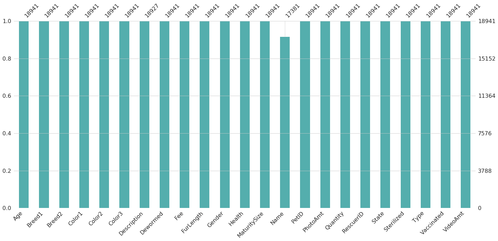


* The only variable with missing values is the "Name".
* My intuition is that people are more likely to respond positively to listed pets with existing names. Imagine a little girl saying:
    * "Aww, look how cute '*Peanut*' is!"

Let's test the hypothesis that the name would play a role in the Adoption Speed. First, we define a new variable ("NameorNot"), then conduct a chi-squared enrichment analysis. Lastly, we examine the standardized residuals to see any effects.


```python
train['NameorNot'] = np.where(train['Name'].isnull(), 'No Name', 'Has a Name')
test['NameorNot'] = np.where(test['Name'].isnull(), 'No Name', 'Has a Name')


df_plot = train.groupby(['NameorNot', 'AdoptionSpeed']).size().reset_index().pivot(
    columns='AdoptionSpeed', index='NameorNot', values=0)
print("Number of Animals by Type")
display(df_plot)

ggDF = train['NameorNot'].value_counts()
count_overview(ggDF, 'NameorNot Count')

tab = pd.crosstab(train['NameorNot'], train['AdoptionSpeed'])
table = sm.stats.Table(tab)

print("Chi-Square Test of Independence: p-value = {:.3E}".format(sp.stats.chi2_contingency(tab)[1]))
display(table.standardized_resids)

stacked_barplot(tab, "Effects of a Name on Adoption Speed")
plt.show()
```

    Number of Animals by Type


<div>
<style scoped>
    .dataframe tbody tr th:only-of-type {
        vertical-align: middle;
    }

    .dataframe tbody tr th {
        vertical-align: top;
    }

    .dataframe thead th {
        text-align: right;
    }
</style>
<table border="1" class="dataframe">
  <thead>
    <tr style="text-align: right;">
      <th>AdoptionSpeed</th>
      <th>0</th>
      <th>1</th>
      <th>2</th>
      <th>3</th>
      <th>4</th>
    </tr>
    <tr>
      <th>NameorNot</th>
      <th></th>
      <th></th>
      <th></th>
      <th></th>
      <th></th>
    </tr>
  </thead>
  <tbody>
    <tr>
      <th>Has a Name</th>
      <td>384</td>
      <td>2819</td>
      <td>3725</td>
      <td>3043</td>
      <td>3765</td>
    </tr>
    <tr>
      <th>No Name</th>
      <td>26</td>
      <td>271</td>
      <td>312</td>
      <td>216</td>
      <td>432</td>
    </tr>
  </tbody>
</table>
</div>


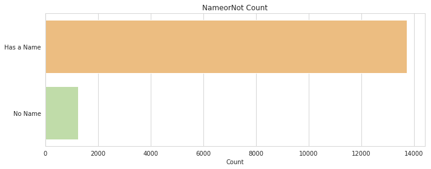


    Chi-Square Test of Independence: p-value = 1.076E-07


<div>
<style scoped>
    .dataframe tbody tr th:only-of-type {
        vertical-align: middle;
    }

    .dataframe tbody tr th {
        vertical-align: top;
    }

    .dataframe thead th {
        text-align: right;
    }
</style>
<table border="1" class="dataframe">
  <thead>
    <tr style="text-align: right;">
      <th>AdoptionSpeed</th>
      <th>0</th>
      <th>1</th>
      <th>2</th>
      <th>3</th>
      <th>4</th>
    </tr>
    <tr>
      <th>NameorNot</th>
      <th></th>
      <th></th>
      <th></th>
      <th></th>
      <th></th>
    </tr>
  </thead>
  <tbody>
    <tr>
      <th>Has a Name</th>
      <td>1.513055</td>
      <td>-0.869614</td>
      <td>1.757704</td>
      <td>4.0889</td>
      <td>-5.259132</td>
    </tr>
    <tr>
      <th>No Name</th>
      <td>-1.513055</td>
      <td>0.869614</td>
      <td>-1.757704</td>
      <td>-4.0889</td>
      <td>5.259132</td>
    </tr>
  </tbody>
</table>
</div>


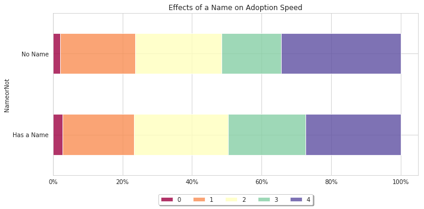


Looking at the standardized residuals table and the bottom plot, we can see that pets that are listed without a name are more likely to NOT be adopted.

* As a rule of thumb, values outside the range of [-2, 2] exhibit a lower or higher than expected frequency, respectively.

<a id='Variable-Visualizations'></a>

## Variable Visualizations

Let's split the training dataset into categorical and numeric subsets to make it easier to visualize

### Target Variable (Adoption Speed)


```python
ggDF = pd.DataFrame(train['AdoptionSpeed'].value_counts().rename({0: '0 (Same Day)', 1: '1 (1-7 Days)', 2: '2 (8-30 Days)', 3: '3 (31-90 Days)', 4: '4 (No Adoption After 100 Days)'}))
ggDF['Order'] = [4, 2, 3, 1, 0]
ggDF.sort_values('Order', inplace=True, ascending=True)
count_overview(ggDF['AdoptionSpeed'], 'AdoptionSpeed (Target Variable)')
```


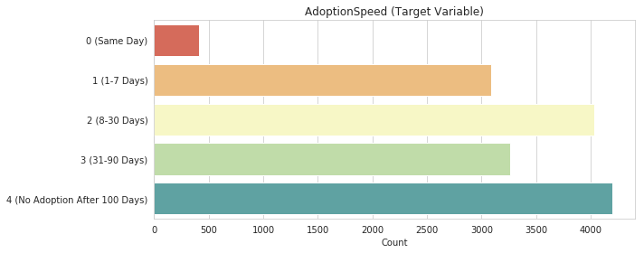


### Cats vs Dogs


```python
df_plot = train.groupby(['Type', 'AdoptionSpeed']).size().reset_index().pivot(columns='AdoptionSpeed', index='Type', values=0).rename({1: 'Dog', 2: 'Cat'})
print("Number of Animals by Type")
display(df_plot)

ggDF = train['Type'].value_counts().rename({1: 'Dog', 2: 'Cat'})
count_overview(ggDF, 'Type Count')

tab = pd.crosstab(train['Type'], train['AdoptionSpeed']).rename({1: 'Dog', 2: 'Cat'})
table = sm.stats.Table(tab)

print("Chi-Square Test of Independence: p-value = {:.3E}".format(sp.stats.chi2_contingency(tab)[1]))
display(table.standardized_resids)

stacked_barplot(tab, "Adoption Speed by Type")
plt.show()
```

    Number of Animals by Type


<div>
<style scoped>
    .dataframe tbody tr th:only-of-type {
        vertical-align: middle;
    }

    .dataframe tbody tr th {
        vertical-align: top;
    }

    .dataframe thead th {
        text-align: right;
    }
</style>
<table border="1" class="dataframe">
  <thead>
    <tr style="text-align: right;">
      <th>AdoptionSpeed</th>
      <th>0</th>
      <th>1</th>
      <th>2</th>
      <th>3</th>
      <th>4</th>
    </tr>
    <tr>
      <th>Type</th>
      <th></th>
      <th></th>
      <th></th>
      <th></th>
      <th></th>
    </tr>
  </thead>
  <tbody>
    <tr>
      <th>Dog</th>
      <td>170</td>
      <td>1435</td>
      <td>2164</td>
      <td>1949</td>
      <td>2414</td>
    </tr>
    <tr>
      <th>Cat</th>
      <td>240</td>
      <td>1655</td>
      <td>1873</td>
      <td>1310</td>
      <td>1783</td>
    </tr>
  </tbody>
</table>
</div>


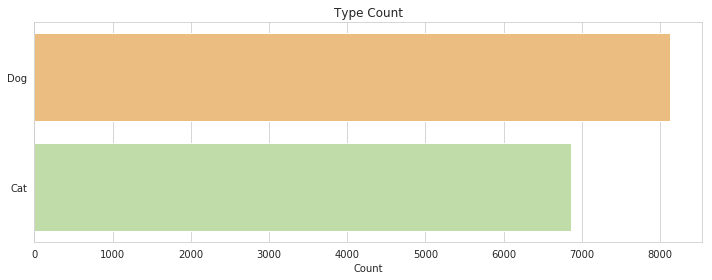


    Chi-Square Test of Independence: p-value = 5.010E-34


<div>
<style scoped>
    .dataframe tbody tr th:only-of-type {
        vertical-align: middle;
    }

    .dataframe tbody tr th {
        vertical-align: top;
    }

    .dataframe thead th {
        text-align: right;
    }
</style>
<table border="1" class="dataframe">
  <thead>
    <tr style="text-align: right;">
      <th>AdoptionSpeed</th>
      <th>0</th>
      <th>1</th>
      <th>2</th>
      <th>3</th>
      <th>4</th>
    </tr>
    <tr>
      <th>Type</th>
      <th></th>
      <th></th>
      <th></th>
      <th></th>
      <th></th>
    </tr>
  </thead>
  <tbody>
    <tr>
      <th>Dog</th>
      <td>-5.264749</td>
      <td>-9.7657</td>
      <td>-0.946594</td>
      <td>7.208134</td>
      <td>5.024245</td>
    </tr>
    <tr>
      <th>Cat</th>
      <td>5.264749</td>
      <td>9.7657</td>
      <td>0.946594</td>
      <td>-7.208134</td>
      <td>-5.024245</td>
    </tr>
  </tbody>
</table>
</div>


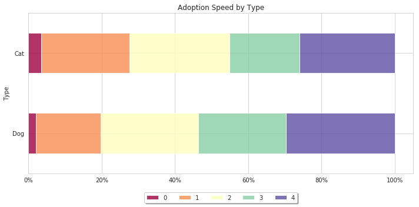


It seems cats are more likely to be adopted sooner, compared to dogs. This may be due to the larger responsibility & commitment associated with owning a dog.

### Gender


```python
df_plot = train.groupby(['Gender', 'AdoptionSpeed']).size().reset_index().pivot(
    columns='AdoptionSpeed', index='Gender', values=0).rename({1: 'Male', 2: 'Female', 3: 'Mixed (Groups of Pets)'})
print("Number of Animals by Gender")
display(df_plot)

ggDF = train['Gender'].value_counts().rename({1: 'Male', 2: 'Female', 3: 'Mixed (Groups of Pets)'})
count_overview(ggDF, 'Gender Count')

tab = pd.crosstab(train['Gender'], train['AdoptionSpeed']).rename({1: 'Male', 2: 'Female', 3: 'Mixed (Groups of Pets)'})
table = sm.stats.Table(tab)
print("Chi-Square Test of Independence: p-value = {:.3E}".format(sp.stats.chi2_contingency(tab)[1]))
display(table.standardized_resids)

stacked_barplot(tab, "Adoption Speed by Type")
plt.show()
```

    Number of Animals by Gender


<div>
<style scoped>
    .dataframe tbody tr th:only-of-type {
        vertical-align: middle;
    }

    .dataframe tbody tr th {
        vertical-align: top;
    }

    .dataframe thead th {
        text-align: right;
    }
</style>
<table border="1" class="dataframe">
  <thead>
    <tr style="text-align: right;">
      <th>AdoptionSpeed</th>
      <th>0</th>
      <th>1</th>
      <th>2</th>
      <th>3</th>
      <th>4</th>
    </tr>
    <tr>
      <th>Gender</th>
      <th></th>
      <th></th>
      <th></th>
      <th></th>
      <th></th>
    </tr>
  </thead>
  <tbody>
    <tr>
      <th>Male</th>
      <td>160</td>
      <td>1283</td>
      <td>1578</td>
      <td>1109</td>
      <td>1406</td>
    </tr>
    <tr>
      <th>Female</th>
      <td>204</td>
      <td>1366</td>
      <td>1911</td>
      <td>1671</td>
      <td>2125</td>
    </tr>
    <tr>
      <th>Mixed (Groups of Pets)</th>
      <td>46</td>
      <td>441</td>
      <td>548</td>
      <td>479</td>
      <td>666</td>
    </tr>
  </tbody>
</table>
</div>


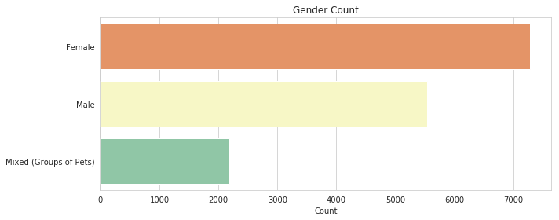


    Chi-Square Test of Independence: p-value = 1.871E-13


<div>
<style scoped>
    .dataframe tbody tr th:only-of-type {
        vertical-align: middle;
    }

    .dataframe tbody tr th {
        vertical-align: top;
    }

    .dataframe thead th {
        text-align: right;
    }
</style>
<table border="1" class="dataframe">
  <thead>
    <tr style="text-align: right;">
      <th>AdoptionSpeed</th>
      <th>0</th>
      <th>1</th>
      <th>2</th>
      <th>3</th>
      <th>4</th>
    </tr>
    <tr>
      <th>Gender</th>
      <th></th>
      <th></th>
      <th></th>
      <th></th>
      <th></th>
    </tr>
  </thead>
  <tbody>
    <tr>
      <th>Male</th>
      <td>0.893609</td>
      <td>5.942875</td>
      <td>3.333695</td>
      <td>-3.871096</td>
      <td>-5.416289</td>
    </tr>
    <tr>
      <th>Female</th>
      <td>0.501221</td>
      <td>-5.403628</td>
      <td>-1.782910</td>
      <td>3.534435</td>
      <td>3.200882</td>
    </tr>
    <tr>
      <th>Mixed (Groups of Pets)</th>
      <td>-1.934038</td>
      <td>-0.474798</td>
      <td>-2.036183</td>
      <td>0.288581</td>
      <td>2.876952</td>
    </tr>
  </tbody>
</table>
</div>


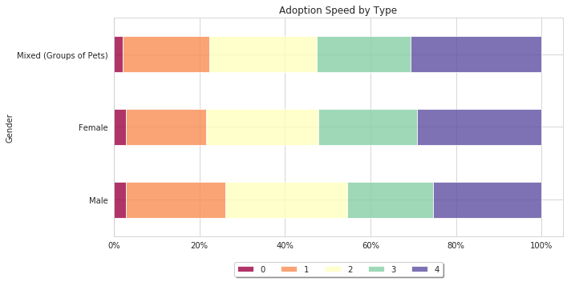


```python
plt.figure(figsize=(12,5))
sns.distplot(train['Age'], kde=False, bins=100, hist_kws=dict(alpha=0.85), color=sns.color_palette("Spectral", 5)[4]).set_title('Age Distribution')
plt.show()
```


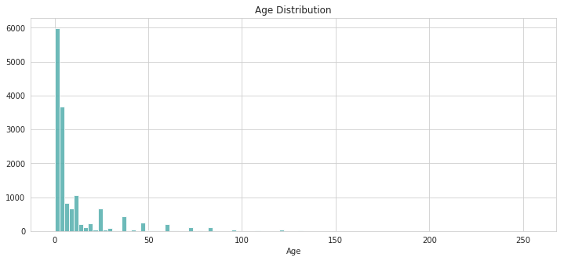


There seems to be a large number of outliers (very old pets), but the median value (50th percentile) is the same for both cats and dogs. The average age of pets up for adoption is 3 months.

* *Fun fact*: This coincidences with the end of socialization period and the start of the juvenile period in dogs. Cats on the other hand are still considered kittens for another 3 months.


```python
display(train[['AdoptionSpeed', 'Age']].groupby('AdoptionSpeed').describe())
sns.barplot(x=train.AdoptionSpeed, y=train.Age, palette = 'Spectral')
plt.show()
```


<div>
<style scoped>
    .dataframe tbody tr th:only-of-type {
        vertical-align: middle;
    }

    .dataframe tbody tr th {
        vertical-align: top;
    }

    .dataframe thead tr th {
        text-align: left;
    }

    .dataframe thead tr:last-of-type th {
        text-align: right;
    }
</style>
<table border="1" class="dataframe">
  <thead>
    <tr>
      <th></th>
      <th colspan="8" halign="left">Age</th>
    </tr>
    <tr>
      <th></th>
      <th>count</th>
      <th>mean</th>
      <th>std</th>
      <th>min</th>
      <th>25%</th>
      <th>50%</th>
      <th>75%</th>
      <th>max</th>
    </tr>
    <tr>
      <th>AdoptionSpeed</th>
      <th></th>
      <th></th>
      <th></th>
      <th></th>
      <th></th>
      <th></th>
      <th></th>
      <th></th>
    </tr>
  </thead>
  <tbody>
    <tr>
      <th>0</th>
      <td>410.0</td>
      <td>10.451220</td>
      <td>17.775118</td>
      <td>0.0</td>
      <td>2.0</td>
      <td>3.0</td>
      <td>12.0</td>
      <td>120.0</td>
    </tr>
    <tr>
      <th>1</th>
      <td>3090.0</td>
      <td>8.488350</td>
      <td>15.746187</td>
      <td>0.0</td>
      <td>2.0</td>
      <td>2.0</td>
      <td>6.0</td>
      <td>147.0</td>
    </tr>
    <tr>
      <th>2</th>
      <td>4037.0</td>
      <td>8.823631</td>
      <td>16.779013</td>
      <td>0.0</td>
      <td>2.0</td>
      <td>3.0</td>
      <td>6.0</td>
      <td>156.0</td>
    </tr>
    <tr>
      <th>3</th>
      <td>3259.0</td>
      <td>10.189936</td>
      <td>18.672104</td>
      <td>0.0</td>
      <td>2.0</td>
      <td>3.0</td>
      <td>9.0</td>
      <td>212.0</td>
    </tr>
    <tr>
      <th>4</th>
      <td>4197.0</td>
      <td>13.667858</td>
      <td>20.177460</td>
      <td>0.0</td>
      <td>3.0</td>
      <td>6.0</td>
      <td>15.0</td>
      <td>255.0</td>
    </tr>
  </tbody>
</table>
</div>


    /opt/conda/lib/python3.6/site-packages/scipy/stats/stats.py:1713: FutureWarning: Using a non-tuple sequence for multidimensional indexing is deprecated; use `arr[tuple(seq)]` instead of `arr[seq]`. In the future this will be interpreted as an array index, `arr[np.array(seq)]`, which will result either in an error or a different result.
      return np.add.reduce(sorted[indexer] * weights, axis=axis) / sumval


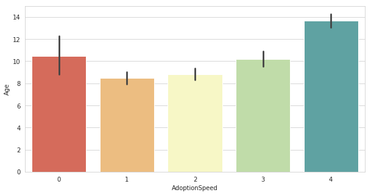


As expected, pets that are not adopted after 100 days are on average much older pets. Interestingly, the pets that were adopted on the same day ranged in all ages. There must be another factor in play that makes people adopt immediately within one day.


### PhotoAmt - Can you have too many cute pictures?

    Spoiler Alert: You can't!


```python
plt.figure(figsize=(10,5))
sns.distplot(train['PhotoAmt'], kde=False, bins=30, hist_kws=dict(alpha=0.85), color=sns.color_palette("Spectral", 5)[4]).set_title('PhotoAmt Distribution')
plt.show()
```


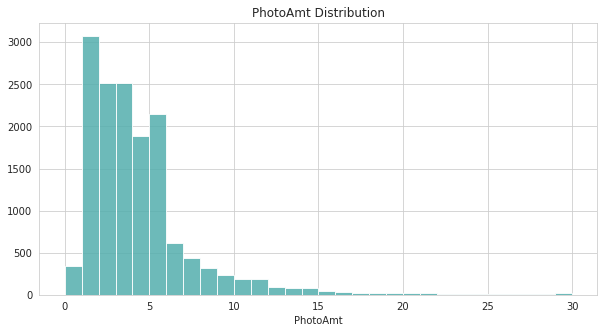


It's highly unlikely that the difference between 7 and 8 pictures will be the deciding factor for adoption, but we can group the number of photos  into a new variable (***PhotosType***).

The threshold for the number of photos for each class were somewhat arbitrarily, but the histogram above shows a steep drop in PhotoAmt after 5. The ***PhotoType*** classes correspond to the following number of pictures:
> * *No Photos*: 0 photos available
> * *Few Photos*: Between 1-5 photos
> * *Many Photos*: More than 5 photos


```python
train['PhotosType'] = "No Photos"
train['PhotosType'] = np.where(train['PhotoAmt']>1, 'Few Photos', train['PhotosType'])
train['PhotosType'] = np.where(train['PhotoAmt']>5, 'Many Photos', train['PhotosType'])

test['PhotosType'] = "No Photos"
test['PhotosType'] = np.where(test['PhotoAmt']>1, 'Few Photos', test['PhotosType'])
test['PhotosType'] = np.where(test['PhotoAmt']>5, 'Many Photos', test['PhotosType'])
```


```python
df_plot = train.groupby(['PhotosType', 'AdoptionSpeed']).size().reset_index().pivot(
    columns='AdoptionSpeed', index='PhotosType', values=0)
print("Number of Pets Adopted by Number of Photos Available")
display(df_plot)

ggDF = train['PhotosType'].value_counts()
count_overview(ggDF, 'Photos Type Count')

tab = pd.crosstab(train['PhotosType'], train['AdoptionSpeed'])
table = sm.stats.Table(tab)
print("Chi-Square Test of Independence: p-value = {:.3E}".format(sp.stats.chi2_contingency(tab)[1]))
display(table.standardized_resids)

stacked_barplot(tab, "Adoption Speed by Number of Photos")
plt.show()
```

    Number of Pets Adopted by Number of Photos Available


<div>
<style scoped>
    .dataframe tbody tr th:only-of-type {
        vertical-align: middle;
    }

    .dataframe tbody tr th {
        vertical-align: top;
    }

    .dataframe thead th {
        text-align: right;
    }
</style>
<table border="1" class="dataframe">
  <thead>
    <tr style="text-align: right;">
      <th>AdoptionSpeed</th>
      <th>0</th>
      <th>1</th>
      <th>2</th>
      <th>3</th>
      <th>4</th>
    </tr>
    <tr>
      <th>PhotosType</th>
      <th></th>
      <th></th>
      <th></th>
      <th></th>
      <th></th>
    </tr>
  </thead>
  <tbody>
    <tr>
      <th>Few Photos</th>
      <td>268</td>
      <td>2003</td>
      <td>2460</td>
      <td>1818</td>
      <td>2508</td>
    </tr>
    <tr>
      <th>Many Photos</th>
      <td>43</td>
      <td>438</td>
      <td>758</td>
      <td>815</td>
      <td>466</td>
    </tr>
    <tr>
      <th>No Photos</th>
      <td>99</td>
      <td>649</td>
      <td>819</td>
      <td>626</td>
      <td>1223</td>
    </tr>
  </tbody>
</table>
</div>


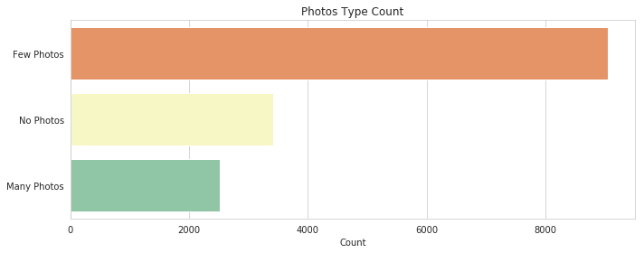


    Chi-Square Test of Independence: p-value = 3.302E-76


<div>
<style scoped>
    .dataframe tbody tr th:only-of-type {
        vertical-align: middle;
    }

    .dataframe tbody tr th {
        vertical-align: top;
    }

    .dataframe thead th {
        text-align: right;
    }
</style>
<table border="1" class="dataframe">
  <thead>
    <tr style="text-align: right;">
      <th>AdoptionSpeed</th>
      <th>0</th>
      <th>1</th>
      <th>2</th>
      <th>3</th>
      <th>4</th>
    </tr>
    <tr>
      <th>PhotosType</th>
      <th></th>
      <th></th>
      <th></th>
      <th></th>
      <th></th>
    </tr>
  </thead>
  <tbody>
    <tr>
      <th>Few Photos</th>
      <td>2.081322</td>
      <td>5.630655</td>
      <td>0.802700</td>
      <td>-6.101690</td>
      <td>-1.016624</td>
    </tr>
    <tr>
      <th>Many Photos</th>
      <td>-3.470047</td>
      <td>-4.393020</td>
      <td>3.912735</td>
      <td>14.150472</td>
      <td>-11.647052</td>
    </tr>
    <tr>
      <th>No Photos</th>
      <td>0.666870</td>
      <td>-2.648652</td>
      <td>-4.424175</td>
      <td>-5.501059</td>
      <td>11.568863</td>
    </tr>
  </tbody>
</table>
</div>


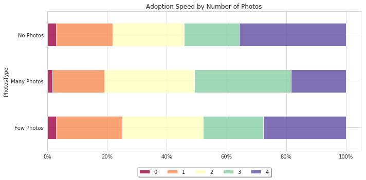


Having no photos seems to be a big factor associated with pets not being adopted after 100 days.

### Location (Location, Location)


```python
states = pd.read_csv('../input/state_labels.csv')
states.index = states['StateID']
states_dict = states.to_dict()

state_counts = pd.crosstab(train['State'], train['AdoptionSpeed'])
state_counts.index = state_counts.index.map(states_dict['StateName'])

state_totals = state_counts.copy(deep=True)
state_totals['Total'] = state_counts.sum(axis=1)
display(state_totals)


plt.figure(figsize=(10,6))
ax = sns.barplot(x=state_totals.Total, y = state_totals.index, palette="Spectral")
ax.set_title("Adoptions by State")
plt.xlabel('Count')
plt.tight_layout()
plt.show()


stacked_barplot(state_counts, 'Adoption Speed by State')
```


<div>
<style scoped>
    .dataframe tbody tr th:only-of-type {
        vertical-align: middle;
    }

    .dataframe tbody tr th {
        vertical-align: top;
    }

    .dataframe thead th {
        text-align: right;
    }
</style>
<table border="1" class="dataframe">
  <thead>
    <tr style="text-align: right;">
      <th>AdoptionSpeed</th>
      <th>0</th>
      <th>1</th>
      <th>2</th>
      <th>3</th>
      <th>4</th>
      <th>Total</th>
    </tr>
    <tr>
      <th>State</th>
      <th></th>
      <th></th>
      <th></th>
      <th></th>
      <th></th>
      <th></th>
    </tr>
  </thead>
  <tbody>
    <tr>
      <th>Melaka</th>
      <td>4</td>
      <td>18</td>
      <td>23</td>
      <td>12</td>
      <td>80</td>
      <td>137</td>
    </tr>
    <tr>
      <th>Kedah</th>
      <td>3</td>
      <td>14</td>
      <td>34</td>
      <td>23</td>
      <td>36</td>
      <td>110</td>
    </tr>
    <tr>
      <th>Selangor</th>
      <td>246</td>
      <td>1877</td>
      <td>2435</td>
      <td>2004</td>
      <td>2152</td>
      <td>8714</td>
    </tr>
    <tr>
      <th>Pulau Pinang</th>
      <td>8</td>
      <td>122</td>
      <td>216</td>
      <td>197</td>
      <td>300</td>
      <td>843</td>
    </tr>
    <tr>
      <th>Perak</th>
      <td>3</td>
      <td>48</td>
      <td>111</td>
      <td>117</td>
      <td>141</td>
      <td>420</td>
    </tr>
    <tr>
      <th>Negeri Sembilan</th>
      <td>4</td>
      <td>36</td>
      <td>63</td>
      <td>42</td>
      <td>108</td>
      <td>253</td>
    </tr>
    <tr>
      <th>Pahang</th>
      <td>3</td>
      <td>29</td>
      <td>14</td>
      <td>16</td>
      <td>23</td>
      <td>85</td>
    </tr>
    <tr>
      <th>Johor</th>
      <td>23</td>
      <td>113</td>
      <td>136</td>
      <td>103</td>
      <td>132</td>
      <td>507</td>
    </tr>
    <tr>
      <th>Sarawak</th>
      <td>1</td>
      <td>1</td>
      <td>0</td>
      <td>2</td>
      <td>9</td>
      <td>13</td>
    </tr>
    <tr>
      <th>Sabah</th>
      <td>1</td>
      <td>6</td>
      <td>3</td>
      <td>4</td>
      <td>8</td>
      <td>22</td>
    </tr>
    <tr>
      <th>Terengganu</th>
      <td>0</td>
      <td>9</td>
      <td>2</td>
      <td>6</td>
      <td>9</td>
      <td>26</td>
    </tr>
    <tr>
      <th>Kelantan</th>
      <td>2</td>
      <td>3</td>
      <td>3</td>
      <td>1</td>
      <td>6</td>
      <td>15</td>
    </tr>
    <tr>
      <th>Kuala Lumpur</th>
      <td>112</td>
      <td>814</td>
      <td>996</td>
      <td>731</td>
      <td>1192</td>
      <td>3845</td>
    </tr>
    <tr>
      <th>Labuan</th>
      <td>0</td>
      <td>0</td>
      <td>1</td>
      <td>1</td>
      <td>1</td>
      <td>3</td>
    </tr>
  </tbody>
</table>
</div>


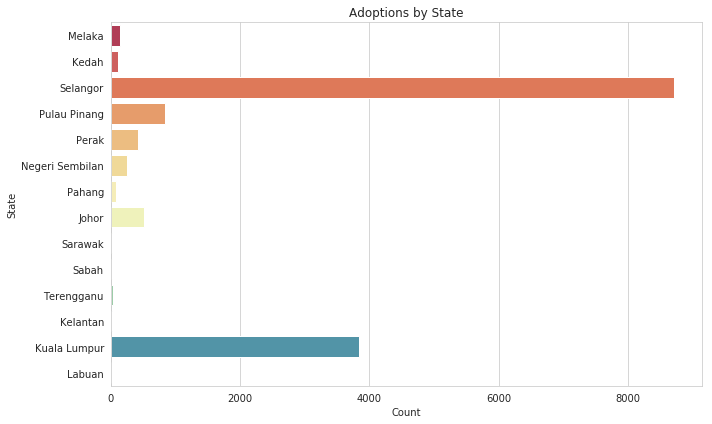


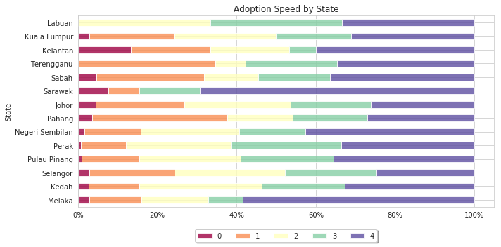


There is a clear difference in adoption speeds between the different states. Sarawak and Melaka have the highest proportion of pets left unadopted after 100 days compared to Kelatan and Sarawak, which have the lowest proportions.

### Purebreed vs Mudblood Mutts?


```python
train['Purebreed'] = np.where(train['Breed2'] == 0, 'Pure Breed', 'Mixed Breed')
test['Purebreed'] = np.where(test['Breed2'] == 0, 'Pure Breed', 'Mixed Breed')

df_plot = train.groupby(['Purebreed', 'AdoptionSpeed']).size().reset_index().pivot(
    columns='AdoptionSpeed', index='Purebreed', values=0)
print("Number of Pets Adopted by Number of Photos Available")
display(df_plot)

ggDF = train['Purebreed'].value_counts()
count_overview(ggDF, 'Photos Type Count')

tab = pd.crosstab(train['Purebreed'], train['AdoptionSpeed'])
table = sm.stats.Table(tab)
print("Chi-Square Test of Independence: p-value = {:.3E}".format(sp.stats.chi2_contingency(tab)[1]))
display(table.standardized_resids)

stacked_barplot(tab, "Adoption Speed by Number of Photos")
plt.show()
```

    Number of Pets Adopted by Number of Photos Available


<div>
<style scoped>
    .dataframe tbody tr th:only-of-type {
        vertical-align: middle;
    }

    .dataframe tbody tr th {
        vertical-align: top;
    }

    .dataframe thead th {
        text-align: right;
    }
</style>
<table border="1" class="dataframe">
  <thead>
    <tr style="text-align: right;">
      <th>AdoptionSpeed</th>
      <th>0</th>
      <th>1</th>
      <th>2</th>
      <th>3</th>
      <th>4</th>
    </tr>
    <tr>
      <th>Purebreed</th>
      <th></th>
      <th></th>
      <th></th>
      <th></th>
      <th></th>
    </tr>
  </thead>
  <tbody>
    <tr>
      <th>Mixed Breed</th>
      <td>157</td>
      <td>876</td>
      <td>1133</td>
      <td>992</td>
      <td>1073</td>
    </tr>
    <tr>
      <th>Pure Breed</th>
      <td>253</td>
      <td>2214</td>
      <td>2904</td>
      <td>2267</td>
      <td>3124</td>
    </tr>
  </tbody>
</table>
</div>


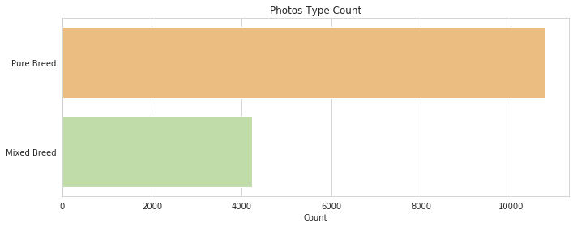


    Chi-Square Test of Independence: p-value = 9.746E-09


<div>
<style scoped>
    .dataframe tbody tr th:only-of-type {
        vertical-align: middle;
    }

    .dataframe tbody tr th {
        vertical-align: top;
    }

    .dataframe thead th {
        text-align: right;
    }
</style>
<table border="1" class="dataframe">
  <thead>
    <tr style="text-align: right;">
      <th>AdoptionSpeed</th>
      <th>0</th>
      <th>1</th>
      <th>2</th>
      <th>3</th>
      <th>4</th>
    </tr>
    <tr>
      <th>Purebreed</th>
      <th></th>
      <th></th>
      <th></th>
      <th></th>
      <th></th>
    </tr>
  </thead>
  <tbody>
    <tr>
      <th>Mixed Breed</th>
      <td>4.595</td>
      <td>0.179756</td>
      <td>-0.255053</td>
      <td>3.181495</td>
      <td>-4.501907</td>
    </tr>
    <tr>
      <th>Pure Breed</th>
      <td>-4.595</td>
      <td>-0.179756</td>
      <td>0.255053</td>
      <td>-3.181495</td>
      <td>4.501907</td>
    </tr>
  </tbody>
</table>
</div>


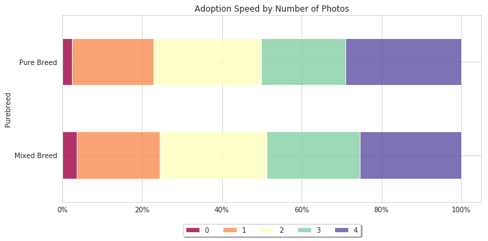


Mixed breeds seem to be adopted faster than pure breeds

### What's better than free?

First, let's see the distribution of fees


```python
ax = sns.distplot(train['Fee'], kde=False, bins=50, hist_kws=dict(alpha=0.85), color=sns.color_palette("Spectral", 5)[4])
ax.set_title('Fee Distribution (Log Scale)')
ax.set_yscale('log')
```


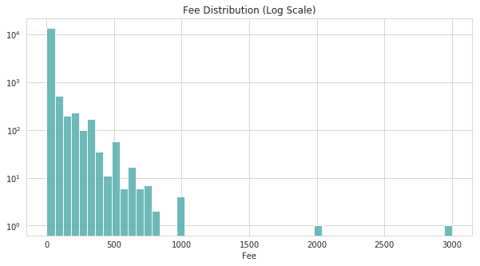


* *Note*: The fee cost on the y-axis is in log scale. So there is several thousand more pets up for adoption with no cost than at any price.

Let's convert the fee variable into a new categorical variable (***PayorNot***). This group is composed of:
> * Free - No fee associated with adoption
> * Paid Adoption - Fee associated with adoption


```python
train['PayorNot'] = np.where(train['Fee'] == 0, 'Free', 'Paid Adoption')
test['PayorNot'] = np.where(test['Fee'] == 0, 'Free', 'Paid Adoption')


df_plot = train.groupby(['PayorNot', 'AdoptionSpeed']).size().reset_index().pivot(
    columns='AdoptionSpeed', index='PayorNot', values=0).rename({0: 'Free', 1: 'Paid Adoption'})
print("Number of Pets Adopted by Number of Photos Available")
display(df_plot)

ggDF = train['PayorNot'].value_counts()
count_overview(ggDF, 'Photos Type Count')

tab = pd.crosstab(train['PayorNot'], train['AdoptionSpeed'])
table = sm.stats.Table(tab)
print("Chi-Square Test of Independence: p-value = {:.3E}".format(sp.stats.chi2_contingency(tab)[1]))
display(table.standardized_resids)

stacked_barplot(tab, "Adoption Speed by Number of Photos")
plt.show()
```

    Number of Pets Adopted by Number of Photos Available


<div>
<style scoped>
    .dataframe tbody tr th:only-of-type {
        vertical-align: middle;
    }

    .dataframe tbody tr th {
        vertical-align: top;
    }

    .dataframe thead th {
        text-align: right;
    }
</style>
<table border="1" class="dataframe">
  <thead>
    <tr style="text-align: right;">
      <th>AdoptionSpeed</th>
      <th>0</th>
      <th>1</th>
      <th>2</th>
      <th>3</th>
      <th>4</th>
    </tr>
    <tr>
      <th>PayorNot</th>
      <th></th>
      <th></th>
      <th></th>
      <th></th>
      <th></th>
    </tr>
  </thead>
  <tbody>
    <tr>
      <th>Free</th>
      <td>357</td>
      <td>2611</td>
      <td>3430</td>
      <td>2789</td>
      <td>3476</td>
    </tr>
    <tr>
      <th>Paid Adoption</th>
      <td>53</td>
      <td>479</td>
      <td>607</td>
      <td>470</td>
      <td>721</td>
    </tr>
  </tbody>
</table>
</div>


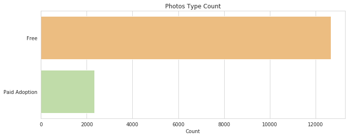


    Chi-Square Test of Independence: p-value = 5.575E-03


<div>
<style scoped>
    .dataframe tbody tr th:only-of-type {
        vertical-align: middle;
    }

    .dataframe tbody tr th {
        vertical-align: top;
    }

    .dataframe thead th {
        text-align: right;
    }
</style>
<table border="1" class="dataframe">
  <thead>
    <tr style="text-align: right;">
      <th>AdoptionSpeed</th>
      <th>0</th>
      <th>1</th>
      <th>2</th>
      <th>3</th>
      <th>4</th>
    </tr>
    <tr>
      <th>PayorNot</th>
      <th></th>
      <th></th>
      <th></th>
      <th></th>
      <th></th>
    </tr>
  </thead>
  <tbody>
    <tr>
      <th>Free</th>
      <td>1.481222</td>
      <td>0.067103</td>
      <td>1.03537</td>
      <td>1.993102</td>
      <td>-3.452485</td>
    </tr>
    <tr>
      <th>Paid Adoption</th>
      <td>-1.481222</td>
      <td>-0.067103</td>
      <td>-1.03537</td>
      <td>-1.993102</td>
      <td>3.452485</td>
    </tr>
  </tbody>
</table>
</div>


* The effects of a fee seems negligible, but there is some evidence that pets that are not adopted after the 100 days are likely to have a fee associated with them. This might be due to the adoption shelters attempting to recoup their costs.


```python
plt.figure(figsize=(12,5))
sns.distplot(train[train['PayorNot'] != 'Free']['Fee'], kde=False, bins=30, hist_kws=dict(alpha=0.85), color=sns.color_palette("Spectral", 5)[4]).set_title('Age Distribution')
plt.show()
```


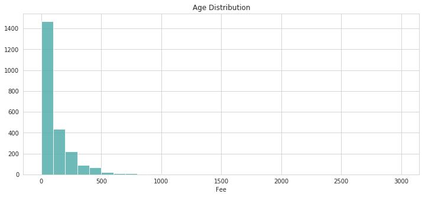


### Length of Description


```python
train['DescriptionLength'] = train['Description'].apply(lambda x: len(str(x)))
sns.distplot(train['DescriptionLength'], kde=False, bins=50, hist_kws=dict(alpha=0.85), color=sns.color_palette("Spectral", 5)[4])
plt.show()

test['DescriptionLength'] = test['Description'].apply(lambda x: len(str(x)))

```


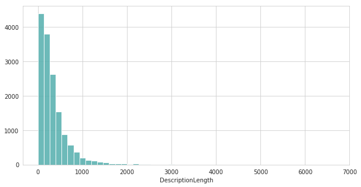


```python
sns.boxplot(x = train['AdoptionSpeed'], y = train['DescriptionLength'])
plt.show()
```


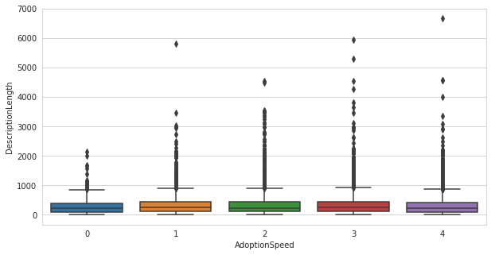


```python
gr = train.groupby('AdoptionSpeed').DescriptionLength
for label, arr in gr:
    sns.kdeplot(arr, label=label, shade=True)
```

    /opt/conda/lib/python3.6/site-packages/scipy/stats/stats.py:1713: FutureWarning: Using a non-tuple sequence for multidimensional indexing is deprecated; use `arr[tuple(seq)]` instead of `arr[seq]`. In the future this will be interpreted as an array index, `arr[np.array(seq)]`, which will result either in an error or a different result.
      return np.add.reduce(sorted[indexer] * weights, axis=axis) / sumval


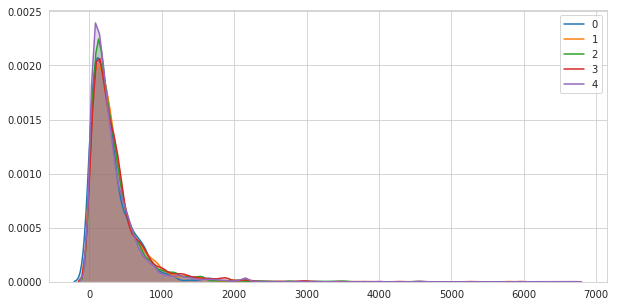


<a id='Caution-Variables'></a>

## Caution Variables

Some of the variables, such as *MaturitySize* or *FurLength*, include labels that are either "Not Specified" or "Not Sure". We will impute these unknown values are the mode (or most common variable).


```python
caution_variables = ['MaturitySize', 'FurLength', 'Health', 'Vaccinated', 'Dewormed', 'Sterilized', 'Health']

for variable in caution_variables:
    train[variable].replace(0, train[variable].mode()[0], regex=True, inplace=True)
    test[variable].replace(0, test[variable].mode()[0], regex=True, inplace=True)
```

<a id='Data-Cleaning'></a>

## Data Cleaning


```python
clean_train = train.drop(columns=['Name', 'RescuerID', 'Description', 'PetID', 'AdoptionSpeed'])
clean_test = test.drop(columns=['Name', 'RescuerID', 'Description', 'PetID'])
```

### Label Encoding


```python
cat_cols = ['PayorNot', 'NameorNot','PhotosType','Purebreed']

for col in cat_cols:
    label = LabelEncoder()
    label.fit(list(clean_train[col].values))
    clean_train[col] = label.transform(list(clean_train[col].values))
    clean_test[col] = label.transform(list(clean_test[col].values))
```

<a id='Tree-Ensemble-Modelling'></a>

## Tree Ensemble Modelling

Let's start by defining the evaluation criteria (quadratic weighted kappa). We will use the sci-kit learn's `cohen_kappa_score` function for cross-validation.


```python
def metric(y1,y2):
    return cohen_kappa_score(y1, y2, weights = 'quadratic')

# Make scorer for scikit-learn
scorer = make_scorer(metric)
```

Models:
- XGBoost (xgboost.sklearn)
- Adaboost (sklearn.ensemble.AdaBoostClassifier)
- Random Forest (sklearn.ensemble.RandomForestClassifier)
- Gradient Boosted (sklearn.ensembl.GradientBoostingClassifier)
- Extra Trees (sklearn.ensembl.ExtraTreesClassifier)


```python
gbm_model = GradientBoostingClassifier()
gbm_grid = {
    'loss' : ['deviance'],
    'learning_rate' : [0.1],
    'n_estimators' : [100],
    'subsample' : [0.8, 0.9],
    'min_samples_split' : [5,10],
    'random_state' : [1234],
    'max_depth' : [5, 7],
    'max_features' : ['auto'],
    'min_samples_leaf': [15,20]
}

gbm_gridsearch = GridSearchCV(estimator = gbm_model,
                              param_grid = gbm_grid,
                              cv = 3,
                              n_jobs = -1,
                              verbose = 1,
                              scoring = scorer)

gbm_gridsearch.fit(clean_train, train_target)
gbm_gridsearch.best_params_
```

    Fitting 3 folds for each of 16 candidates, totalling 48 fits


    [Parallel(n_jobs=-1)]: Using backend LokyBackend with 4 concurrent workers.
    [Parallel(n_jobs=-1)]: Done  48 out of  48 | elapsed:  4.5min finished


    {'learning_rate': 0.1,
     'loss': 'deviance',
     'max_depth': 5,
     'max_features': 'auto',
     'min_samples_leaf': 15,
     'min_samples_split': 5,
     'n_estimators': 100,
     'random_state': 1234,
     'subsample': 0.9}


```python
ada_model = AdaBoostClassifier()
ada_grid = {
    'random_state' : [1234],
    'n_estimators' : [135, 150],
    'learning_rate' : [0.35, 0.5],
    'algorithm' : ['SAMME.R']
}

ada_gridsearch = GridSearchCV(estimator = ada_model,
                              param_grid = ada_grid,
                              cv = 3,
                              n_jobs = -1,
                              verbose = 1,
                              scoring = scorer)

ada_gridsearch.fit(clean_train, train_target)
ada_gridsearch.best_params_
```

    Fitting 3 folds for each of 4 candidates, totalling 12 fits


    [Parallel(n_jobs=-1)]: Using backend LokyBackend with 4 concurrent workers.
    [Parallel(n_jobs=-1)]: Done  12 out of  12 | elapsed:    7.8s finished


    {'algorithm': 'SAMME.R',
     'learning_rate': 0.35,
     'n_estimators': 150,
     'random_state': 1234}


```python
ets_model = ExtraTreesClassifier()
ets_grid = {
    'random_state' : [1234],
    'n_estimators' : [50, 150, 300],
    'criterion' : ['gini'],
    'max_depth' : [10, 25, 50],
    'max_features' : ['auto'],
    'min_samples_split' : [5, 10, 15, 30],
    'min_samples_leaf' : [5, 10, 15, 30],
    'bootstrap' : ['true']
}

ets_gridsearch = GridSearchCV(estimator = ets_model,
                              param_grid = ets_grid,
                              cv = 3,
                              n_jobs = -1,
                              verbose = 1,
                              scoring = scorer)

ets_gridsearch.fit(clean_train, train_target)
print(ets_gridsearch.best_score_)
ets_gridsearch.best_params_

```

    Fitting 3 folds for each of 144 candidates, totalling 432 fits


    [Parallel(n_jobs=-1)]: Using backend LokyBackend with 4 concurrent workers.
    [Parallel(n_jobs=-1)]: Done  42 tasks      | elapsed:   16.3s
    [Parallel(n_jobs=-1)]: Done 192 tasks      | elapsed:  1.3min
    [Parallel(n_jobs=-1)]: Done 432 out of 432 | elapsed:  3.0min finished


    0.2928920722473285


    {'bootstrap': 'true',
     'criterion': 'gini',
     'max_depth': 50,
     'max_features': 'auto',
     'min_samples_leaf': 5,
     'min_samples_split': 5,
     'n_estimators': 300,
     'random_state': 1234}


```python
rfc_model = RandomForestClassifier()
rfc_grid = {
    'random_state' : [1234],
    'n_estimators' : [250, 300, 350],
    'max_depth' : [35, 50, 75],
    'max_features' : ['auto'],
    'min_samples_leaf': [5, 10],
    'min_samples_split': [10, 15]
}

rfc_gridsearch = GridSearchCV(estimator = rfc_model,
                              param_grid = rfc_grid,
                              cv = 3,
                              n_jobs = -1,
                              verbose = 1,
                              scoring = scorer)

rfc_gridsearch.fit(clean_train, train_target)
rfc_gridsearch.best_params_
```

    Fitting 3 folds for each of 36 candidates, totalling 108 fits


    [Parallel(n_jobs=-1)]: Using backend LokyBackend with 4 concurrent workers.
    [Parallel(n_jobs=-1)]: Done  42 tasks      | elapsed:   54.8s
    [Parallel(n_jobs=-1)]: Done 108 out of 108 | elapsed:  2.3min finished


    {'max_depth': 35,
     'max_features': 'auto',
     'min_samples_leaf': 5,
     'min_samples_split': 15,
     'n_estimators': 300,
     'random_state': 1234}


```python
xgb_model = XGBClassifier()
xgb_grid = {
    'n_estimators' : [150, 200],
    'random_state' : [1234],
    'max_depth': [10,12,15],
    'min_child_weight': [2,3],
    'learning_rate': [0.1],
    'gamma': [0.6, 0.7, 0.8]
}

xgb_gridsearch = GridSearchCV(estimator = xgb_model,
                              param_grid = xgb_grid,
                              cv = 3,
                              n_jobs = -1,
                              verbose = 1,
                              scoring = scorer)

xgb_gridsearch.fit(clean_train, train_target)
xgb_gridsearch.best_params_
```

    Fitting 3 folds for each of 36 candidates, totalling 108 fits


    [Parallel(n_jobs=-1)]: Using backend LokyBackend with 4 concurrent workers.
    [Parallel(n_jobs=-1)]: Done  42 tasks      | elapsed:  8.3min
    [Parallel(n_jobs=-1)]: Done 108 out of 108 | elapsed: 21.3min finished


    {'gamma': 0.7,
     'learning_rate': 0.1,
     'max_depth': 10,
     'min_child_weight': 2,
     'n_estimators': 150,
     'random_state': 1234}


```python
print("Best Model Parameters: \n")

print("AdaBoost Classifier Score: {:.4f}\n{}\n".format(ada_gridsearch.best_score_, ada_gridsearch.best_params_))
print("GradientBoosting Classifier Score: {:.4f}\n{}\n".format(gbm_gridsearch.best_score_, gbm_gridsearch.best_params_))
print("Extra Trees Classifier Score: {:.4f}\n{}\n".format(ets_gridsearch.best_score_, ets_gridsearch.best_params_))
print("Random Forest Classifier Score: {:.4f}\n{}\n".format(rfc_gridsearch.best_score_, rfc_gridsearch.best_params_))
print("XGBoost Classifier Score: {:.4f}\n{}\n".format(xgb_gridsearch.best_score_, xgb_gridsearch.best_params_))
```

    Best Model Parameters:

    AdaBoost Classifier Score: 0.3252
    {'algorithm': 'SAMME.R', 'learning_rate': 0.35, 'n_estimators': 150, 'random_state': 1234}

    GradientBoosting Classifier Score: 0.3538
    {'learning_rate': 0.1, 'loss': 'deviance', 'max_depth': 5, 'max_features': 'auto', 'min_samples_leaf': 15, 'min_samples_split': 5, 'n_estimators': 100, 'random_state': 1234, 'subsample': 0.9}

    Extra Trees Classifier Score: 0.2929
    {'bootstrap': 'true', 'criterion': 'gini', 'max_depth': 50, 'max_features': 'auto', 'min_samples_leaf': 5, 'min_samples_split': 5, 'n_estimators': 300, 'random_state': 1234}

    Random Forest Classifier Score: 0.3449
    {'max_depth': 35, 'max_features': 'auto', 'min_samples_leaf': 5, 'min_samples_split': 15, 'n_estimators': 300, 'random_state': 1234}

    XGBoost Classifier Score: 0.3526
    {'gamma': 0.7, 'learning_rate': 0.1, 'max_depth': 10, 'min_child_weight': 2, 'n_estimators': 150, 'random_state': 1234}


<a id='Predictions-&-Submission'></a>

## Predictions & Submission


```python
pred1 = ada_gridsearch.predict(clean_test)
pred2 = gbm_gridsearch.predict(clean_test)
#pred3 = ets_gridsearch.predict(clean_test) # Did not perform well
pred4 = rfc_gridsearch.predict(clean_test)
pred5 = xgb_gridsearch.predict(clean_test)
```


```python
final_preds = pd.DataFrame(data=[pred1, pred2, pred4, pred5]).transpose()
final_preds.columns = (['AdaBoost', 'GradientBoosting', 'Random Forest', 'XGBoost'])
final_preds['Average'] = round(final_preds.mean(axis=1)).astype(int)
final_preds.head()
```


<div>
<style scoped>
    .dataframe tbody tr th:only-of-type {
        vertical-align: middle;
    }

    .dataframe tbody tr th {
        vertical-align: top;
    }

    .dataframe thead th {
        text-align: right;
    }
</style>
<table border="1" class="dataframe">
  <thead>
    <tr style="text-align: right;">
      <th></th>
      <th>AdaBoost</th>
      <th>GradientBoosting</th>
      <th>Random Forest</th>
      <th>XGBoost</th>
      <th>Average</th>
    </tr>
  </thead>
  <tbody>
    <tr>
      <th>0</th>
      <td>2</td>
      <td>2</td>
      <td>2</td>
      <td>2</td>
      <td>2</td>
    </tr>
    <tr>
      <th>1</th>
      <td>4</td>
      <td>4</td>
      <td>4</td>
      <td>4</td>
      <td>4</td>
    </tr>
    <tr>
      <th>2</th>
      <td>4</td>
      <td>4</td>
      <td>4</td>
      <td>4</td>
      <td>4</td>
    </tr>
    <tr>
      <th>3</th>
      <td>4</td>
      <td>4</td>
      <td>4</td>
      <td>3</td>
      <td>4</td>
    </tr>
    <tr>
      <th>4</th>
      <td>4</td>
      <td>4</td>
      <td>4</td>
      <td>4</td>
      <td>4</td>
    </tr>
  </tbody>
</table>
</div>


```python
submission_df = pd.DataFrame(data = {'PetID' : test['PetID'],
                                     'AdoptionSpeed' : final_preds.Average})
submission_df.to_csv('submission.csv', index = False)
```


```python
submission_df.head(3)
```


<div>
<style scoped>
    .dataframe tbody tr th:only-of-type {
        vertical-align: middle;
    }

    .dataframe tbody tr th {
        vertical-align: top;
    }

    .dataframe thead th {
        text-align: right;
    }
</style>
<table border="1" class="dataframe">
  <thead>
    <tr style="text-align: right;">
      <th></th>
      <th>PetID</th>
      <th>AdoptionSpeed</th>
    </tr>
  </thead>
  <tbody>
    <tr>
      <th>0</th>
      <td>378fcc4fc</td>
      <td>2</td>
    </tr>
    <tr>
      <th>1</th>
      <td>73c10e136</td>
      <td>4</td>
    </tr>
    <tr>
      <th>2</th>
      <td>72000c4c5</td>
      <td>4</td>
    </tr>
  </tbody>
</table>
</div>
